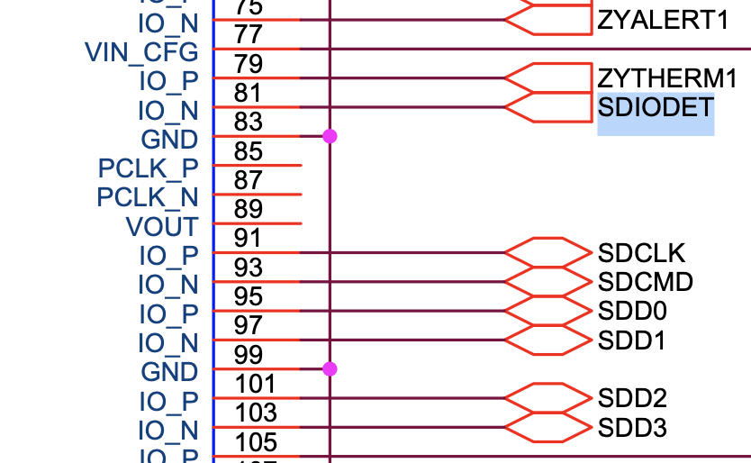

# MPSoC on Endcap SL

Endcap Sector Logic v1


- [MPSoC on Endcap SL](#mpsoc-on-endcap-sl)
  - [Environment](#environment)
  - [✅ CentOS 7のブート](#-centos-7のブート)
    - [Card Detectionの問題](#card-detectionの問題)
  - [✅ PS Ethernet (ETH0)](#-ps-ethernet-eth0)
  - [✅ I<sup>2</sup>CでSi5345をコンフィグレーション](#-isup2supcでsi5345をコンフィグレーション)
    - [失敗1：PAGE registerのことを知らずアクセスの仕方が間違っていた](#失敗1page-registerのことを知らずアクセスの仕方が間違っていた)
    - [例：Si5345レジスタアクセスの仕方](#例si5345レジスタアクセスの仕方)
    - [失敗2：`ioctl(I2C_RDWR)`を使うとバースト転送してしまう](#失敗2ioctli2c_rdwrを使うとバースト転送してしまう)
  - [⬜️  Xilinx Virtual Cable](#️--xilinx-virtual-cable)
    - [Reference](#reference)
    - [MPSoCのPLを遠隔でプログラムする](#mpsocのplを遠隔でプログラムする)
  - [How to set MAC address for PetaLinux OS](#how-to-set-mac-address-for-petalinux-os)

## Environment

- Ubuntu 18.05
  - Vivado 2020.1
  - PetaLinux 2020.1 (It's not supported for Ubuntu 18.05, but worked anyway)
- Mercury XU5 mezzanine card
  - Zynq UltraScale+ MPSoC (5EV)
- Endcap Sector Logic v1 at KEK

## ✅ CentOS 7のブート

- [enclustra/Mercury_XU5_PE1_Reference_Design](https://github.com/enclustra/Mercury_XU5_PE1_Reference_Design.git)を、マニュアルに書いてあるようにVivadoでプロジェクトを開いた

- ブロックデザインのPSをコピーし、新規プロジェクト`MercuryXU5_EndcapSL/`のブロックデザインにペーストした
- PLにGPIO LEDとBRAMを追加した（`MercuryXU5_EndcapSL/design_1.pdf`）
  - Mercury XU5には3-bit LEDが載っているので、幅3のexternal interface portを用意した
  - VivadoのTcl Consoleで、`source MercuryXU5_EndcapSL/design_1.tcl`を実行すれば同じブロックデザインを再現できるはず。
- リファレンスデザインのLEDに関するconstraintsを真似した次の内容の`MercuryXU5_EndcapSL/MercuryXU5_EndcapSL.srcs/constrs_1/new/MercuryXU5_EndcapSL.xdc`を用意した

```tcl
# LED
set_property -dict {PACKAGE_PIN H2    IOSTANDARD LVCMOS18  } [get_ports {LED_N_tri_o[0]}];
set_property -dict {PACKAGE_PIN P9    IOSTANDARD LVCMOS18  } [get_ports {LED_N_tri_o[1]}];
set_property -dict {PACKAGE_PIN K5    IOSTANDARD LVCMOS18  } [get_ports {LED_N_tri_o[2]}];
```

- Generate Bitstream ---> Export Hardware
  - FPGA bitstreamをincludeする
  - `MercuryXU5_EndcapSL/MercuryXU5_EndcapSL.xsa`ができる
- Export Block Designすると`MercuryXU5_EndcapSL/design_1.tcl`ができる
- ここまで書いて気づいたが、あとは昔[Mercury XU5とPE1の組み合わせでCentOS 7をブートした時](https://gitlab.cern.ch/kokazaki/mercury_xu5_petalinux)と、[Hello ZCU102](https://gitlab.cern.ch/kokazaki/hello-zcu102)と同じなので割愛
- BRAMとLEDを操作するソフトウェアは`apps/devmem.c`と`apps/blink.c`

### Card Detectionの問題

- U-Boot時、mmc1 (SD)がないと言われてmmc0 (eMMC)を見に行きブートがストップ
- SL上のSDカードスロットからは`SDIODET`という信号が出ている
  - この信号線はMercury XU5とのコネクタピンA81に入っているが、これはMPSoCのFPGA Bankに入るもの

    <div align="center">
        
    </div>

  - Mercury XU5側でCard Detection (CD)に対応するのは**A98**
    - SL上ではこのピンは何も繋がっていなかったので、U-Bootはこれを見てSDカードが刺さっていないと勘違いしストップしたと考えられる

    <div align="center">
        
    </div>

  - VivadoプロジェクトのPSの設定で、CDに対応するMIO45を使わないようにしたところ、ブートが成功した


## ✅ PS Ethernet (ETH0)

Mercury XU5 PE1 reference designのblock diagram

<div align="center">
    
</div>

- PSの設定をコピーしたので、PSのEthernetはそのまま使えるはず
  - しかし使えなかった
- 調べてみると、EthernetはA, B, C, Dの4線から成り立っているが、SL上ではメザニンとのコネクタで順番が変わっている

    <div align="center">
        
    </div>

  - [Mercury XU5上のEthernet PHY](https://ww1.microchip.com/downloads/en/DeviceDoc/00002117G.pdf)はauto-negotiationの機能がついていて、A-B, C-D間のスワップは正しくマップされ直すが、このようなスワップには対応していなかった
  - 試しにAとD、BとCをスワップさせたLANケーブルを自作したところ、正しく動作した

## ✅ I<sup>2</sup>CでSi5345をコンフィグレーション

- Endcap SLには1つのI<sup>2</sup>C Multiplexerがあり、それを介してMPSoCはclock generators (SI5345B, SI5344B)、温度センサなどとI<sup>2</sup>C通信をしてコンフィグレーションを行う（[東大M1三島くんのスライド](https://indico.cern.ch/event/1086204/contributions/4566957/attachments/2331858/3975145/mishima_20211021.pdf)）
- 過去に[ZCU102のSi570をMPSoCでコンフィギュレーションした経験](https://gitlab.cern.ch/kokazaki/zcu102-clock-gen.git)をもとに開発を進める


- このI<sup>2</sup>C MUXはZCU102に載っているものと同じなので、デバイスツリーはそれを真似して編集した（`plnx_MercuryXU5_EndcapSL/project-spec/meta-user/recipes-bsp/device-tree/files/endcap_sl.dtsi`）

```dts
&i2c0 {
    i2c-mux@70 { /* U23 */
        compatible = "nxp,pca9548";
		#address-cells = <1>;
		#size-cells = <0>;
		reg = <0x70>;
        // i2c@0 { // FireFly connectors
        //     #address-cells = <1>;
        //     #size-cells = <0>;
        //     reg = <0>;
        // };
        // i2c@1 {
        //     #address-cells = <1>;
        //     #size-cells = <0>;
        //     reg = <1>;
        // };
        // i2c@2 { /* U24 */
        //     #address-cells = <1>;
        //     #size-cells = <0>;
        //     reg = <2>;
        // };
        i2c@3 {
            #address-cells = <1>;
            #size-cells = <0>;
            reg = <3>;
            si5345b: clock-generator@68 { /* U1 */
                // https://mjmwired.net/kernel/Documentation/devicetree/bindings/clock/silabs,si5341.txt
                compatible = "silabs,si5345";
                reg = <0x68>;
                #clock-cells = <2>;
                clocks = <40000000>; // 40 MHz
                clock-names = "in0";
                out@0 { reg = <0>; };
                out@1 { reg = <1>; };
                out@2 { reg = <2>; };
                out@3 { reg = <3>; };
                out@4 { reg = <4>; };
                out@5 { reg = <5>; };
                out@6 { reg = <6>; };
                out@7 { reg = <7>; };
                out@8 { reg = <8>; };
            };
        };
        i2c@4 {
            #address-cells = <1>;
            #size-cells = <0>;
            reg = <4>;
            si5344b: clock-generator@68 { /* U2 */
                compatible = "silabs,si5344";
                reg = <0x68>;
                #clock-cells = <2>;
                clocks = <40000000>; // need to change here
                clock-names = "in0";
                out@0 { reg = <0>; };
                out@1 { reg = <1>; };
                out@2 { reg = <2>; };
                out@3 { reg = <3>; };
            };
        };
        // i2c@5 {
        //     #address-cells = <1>;
        //     #size-cells = <0>;
        //     reg = <5>;
        // };
        // i2c@6 {
        //     #address-cells = <1>;
        //     #size-cells = <0>;
        //     reg = <6>;
        // };
        /* port 7 unconnected */
    };
};
```

- U-Bootの設定で、I<sup>2</sup>Cドライバを有効にする（デフォルトで有効になっていた）

    ```bash
    cd /path/to/plnx_MercuryXU5_EndcapSL/
    petalinux-config -c u-boot
    ```

    ```
    Device Drivers ---> I2C Support --->
    ```

    <div align="center">
        
    </div>

    ```bash
    petalinux-build
    cd images/linux/
    petalinux-package --boot --fsbl zynqmp_fsbl.elf --pmufw pmufw.elf --fpga system.bit --u-boot --force
    ```

    - こうして`BOOT.BIN`, `image.ub`, `boot.scr`を更新し、SDカード第1パーティションに置いてrebootする。

- CentOS 7 on MPSoCにログインし、[`i2c-tools`](https://i2c.wiki.kernel.org/index.php/I2C_Tools)をインストール

    ```bash
    sudo yum update
    sudo yum install -y i2c-tools
    ```

- SL上でSi5345はI<sup>2</sup>C MUXのポート3と繋がっており、I<sup>2</sup>C slave addressは`0x68`である
- I<sup>2</sup>C MUXのI<sup>2</sup>C slave addressは`0x70`である

- CentOS 7でI<sup>2</sup>Cデバイスを検出
  - ブートログで確認

    ```bash
    (sl-xu5-01) ~ $ dmesg | grep -e i2c -e I2C
    [    2.265262] i2c /dev entries driver
    [    4.005486] i2c i2c-0: Added multiplexed i2c bus 1
    [    4.010372] i2c i2c-0: Added multiplexed i2c bus 2
    [    4.020637] i2c i2c-0: Added multiplexed i2c bus 3
    [    4.033120] i2c i2c-0: Added multiplexed i2c bus 4
    [    4.047282] i2c i2c-0: Added multiplexed i2c bus 5
    [    4.057894] i2c i2c-0: Added multiplexed i2c bus 6
    [    4.068166] i2c i2c-0: Added multiplexed i2c bus 7
    [    4.081302] i2c i2c-0: Added multiplexed i2c bus 8
    [    4.093173] pca954x 0-0070: registered 8 multiplexed busses for I2C switch pca9548
    [    4.104563] cdns-i2c ff020000.i2c: 400 kHz mmio ff020000 irq 32
    ```
  - デバイスファイルがあることを確認
    ```bash
    (sl-xu5-01) ~ $ ls /dev/i2c-*
    crw------- 1 root root 89, 6  1月  1  1970 /dev/i2c-6
    crw------- 1 root root 89, 5  1月  1  1970 /dev/i2c-5
    crw------- 1 root root 89, 2  1月  1  1970 /dev/i2c-2
    crw------- 1 root root 89, 1  1月  1  1970 /dev/i2c-1
    crw------- 1 root root 89, 8  1月  1  1970 /dev/i2c-8
    crw------- 1 root root 89, 7  1月  1  1970 /dev/i2c-7
    crw------- 1 root root 89, 4  1月  1  1970 /dev/i2c-4
    crw------- 1 root root 89, 3  1月  1  1970 /dev/i2c-3
    crw------- 1 root root 89, 0  1月  1  1970 /dev/i2c-0
    ```
  - `i2cdetect -l`
    ```bash
    (sl-xu5-01) ~ $ sudo i2cdetect -l
    [sudo] okazaki のパスワード:
    i2c-3	i2c       	i2c-0-mux (chan_id 2)           	I2C adapter
    i2c-1	i2c       	i2c-0-mux (chan_id 0)           	I2C adapter
    i2c-8	i2c       	i2c-0-mux (chan_id 7)           	I2C adapter
    i2c-6	i2c       	i2c-0-mux (chan_id 5)           	I2C adapter
    i2c-4	i2c       	i2c-0-mux (chan_id 3)           	I2C adapter
    i2c-2	i2c       	i2c-0-mux (chan_id 1)           	I2C adapter
    i2c-0	i2c       	Cadence I2C at ff020000         	I2C adapter
    i2c-7	i2c       	i2c-0-mux (chan_id 6)           	I2C adapter
    i2c-5	i2c       	i2c-0-mux (chan_id 4)           	I2C adapter
    ```
    Si5345はポート3に繋がっているので、この結果から`i2c-4`のデバイスであることがわかる。
  - `i2cdetect -y -r <bus>`
    ```bash
    (sl-xu5-01) ~ $ sudo i2cdetect -y -r 4
        0  1  2  3  4  5  6  7  8  9  a  b  c  d  e  f
    00:          -- -- -- -- -- -- -- -- -- -- -- -- --
    10: -- -- -- -- -- -- -- -- -- -- -- -- -- -- -- --
    20: -- -- -- -- -- -- -- -- -- -- -- -- -- -- -- --
    30: -- -- -- -- -- -- -- -- -- -- -- -- -- -- -- --
    40: -- -- -- -- -- -- -- -- -- -- -- -- -- -- -- --
    50: -- -- -- -- -- -- -- -- -- -- -- -- -- -- -- --
    60: -- -- -- -- -- -- -- -- 68 -- -- -- -- -- -- --
    70: UU -- -- -- -- -- -- --
    ```
    `0x70`はI<sup>2</sup>C MUX、`0x68`はSi5345のスレーブアドレスに一致する。
  - `i2cdump -y <bus> <address>`
    ```
    (sl-xu5-01) ~ $ sudo i2cdump -y 4 0x68
    No size specified (using byte-data access)
        0  1  2  3  4  5  6  7  8  9  a  b  c  d  e  f    0123456789abcdef
    00: 00 0b 00 00 00 00 00 00 00 00 00 30 00 00 00 00    .?.........0....
    10: 00 00 00 00 00 00 00 00 29 00 a6 22 a6 22 a7 22    ........).?"?"?"
    20: a5 22 a5 22 c3 02 00 00 04 00 00 00 80 00 84 00    ?"?"??..?...?.?.
    30: 84 00 00 10 70 00 00 00 00 00 00 00 22 00 00 00    ?..?p......."...
    40: 00 00 02 00 2f 00 00 05 05 00 1e 00 00 00 1a 00    ..?./..??.?...?.
    50: 18 00 80 00 00 ff 01 0e 01 06 00 00 00 00 00 00    ?.?...????......
    60: 00 00 00 00 00 00 00 00 00 00 00 00 00 00 00 00    ................
    70: 00 00 00 00 00 00 00 00 00 00 00 00 00 00 00 00    ................
    80: 00 00 00 00 00 00 00 00 00 00 00 00 00 00 00 00    ................
    90: 00 00 00 00 00 00 00 00 00 00 00 00 00 00 00 00    ................
    a0: 00 00 00 00 00 00 00 00 00 00 00 00 00 00 00 00    ................
    b0: 00 00 00 00 00 00 00 00 00 00 00 00 00 00 00 00    ................
    c0: 00 00 00 00 00 00 00 00 00 00 00 00 00 00 00 00    ................
    d0: 00 00 00 00 00 00 00 00 00 00 00 00 00 00 00 00    ................
    e0: 00 00 00 00 00 00 00 00 00 00 00 00 00 00 00 00    ................
    f0: 00 00 00 00 00 00 00 00 00 00 00 00 00 00 0f 00    ..............?.
    ```
    これはI<sup>2</sup>Cデバイス内のレジスタをダンプするコマンドだが、何やらデータが入っていることが確認できる。


- [ClockBuilder Pro](https://www.skyworksinc.com/en/application-pages/clockbuilder-pro-software)を用いてコンフィグレーションのリストを`.csv`, `.h`の形式で出力した
  - `./apps/`

次にC言語でSi5345を操作するプログラムを作成した。しかしいくつか失敗していたことがあったのでメモ。

----

### 失敗1：PAGE registerのことを知らずアクセスの仕方が間違っていた

- Si5345のレジスタアドレスは16 bit
- 最初8 bitずつに分けてアクセスしていた（そのような例があった）

```c
    uint8_t addr_per_1Byte[] = {(uint8_t)(reg_addr >> 0 & 0xFF),
                                (uint8_t)(reg_addr >> 8 & 0xFF)};
```

- しかしSi5345にはPAGE registerがあり、アドレスの上位8 bitをそこに書き込んでからread/writeする必要があった

> There is the “Page Register” which is located at address 0x01 on every page. When read, it will indicate the current page. When written, it will change the page to the value entered. There is a page register at address 0x0001, 0x0101, 0x0201, 0x0301, ... etc.

- たとえばレジスタアドレスが`0x051A`ならば、ページ`0x05`、アドレス`0x1A`と解釈する


### 例：Si5345レジスタアクセスの仕方

- アドレス`0x051A`のデータをreadする場合
  1. （現在どのページにいるかはわからないが、）アドレス`0x01`のレジスタに`0x05`を書く（ページ`0x05`に移動）
  1. アドレス`0x1A`のレジスタを読む
- アドレス`0x051A`のレジスタにデータ`0x03`をwriteする場合
  1. （現在どのページにいるかはわからないが、）アドレス`0x01`のレジスタに`0x05`を書く（ページ`0x05`に移動）
  2. アドレス`0x1A`のレジスタに`0x03`を書く


### 失敗2：`ioctl(I2C_RDWR)`を使うとバースト転送してしまう

- ページを指定して正しくwriteしても、その後readすると値が`0x00`に変わるレジスタがあった

<!-- ```
(094/525) Register 0x0102: 0x00 != 0x01
(255/525) Register 0x0306: 0x00 != 0x0E
(364/525) Register 0x0519: 0x00 != 0x48
(365/525) Register 0x051A: 0x00 != 0x03
(402/525) Register 0x0802: 0x00 != 0x35
(403/525) Register 0x0803: 0x00 != 0x05
(506/525) Register 0x0A03: 0x00 != 0x01
(507/525) Register 0x0A04: 0x00 != 0x01
(508/525) Register 0x0A05: 0x00 != 0x01
``` -->

- `SCL`, `SDA`の信号をオシロスコープでみたところ、read時ページレジスタに値を書き込んだ後、STOP conditionを出さず7個続けて`0x00`を書き込んでいるようだった


- 調べてみると、`ioctl()`関数を`I2C_RDWR`モードで使うとバースト転送をするようだった（https://www.kernel.org/doc/Documentation/i2c/dev-interface）

    > `ioctl(file, I2C_RDWR, struct i2c_rdwr_ioctl_data *msgset)`
    > Do combined read/write transaction **without stop in between**.

- バースト転送でなく通常の通信をするならば、`I2C_SLAVE`モードでスレーブアドレスをセットし、`write()`, `read()`を使わなければいけないらしい

    > You can do plain i2c transactions by using read(2) and write(2) calls.
    > You do not need to pass the address byte; instead, set it through ioctl I2C_SLAVE before you try to access the device.


### LinuxからI<sup>2</sup>Cデバイスを操作する2通りのやり方
#### readの場合（Error handlingは省略）
##### ① Do combined read/write transaction without stop in between.

```c
#include <linux/i2c-dev.h>  // struct i2c_rdwr_ioctl_data
#include <linux/i2c.h>      // struct i2c_msg
#include <sys/ioctl.h>      // ioctl()

int i2c_read(uint8_t  reg_addr, uint8_t *pdata) {
    // Open device file /dev/i2c-N
    int fd = open("/dev/i2c-4", O_RDWR);

    // Make I2C-read messages
    struct i2c_msg messages[] = {
        {dev_addr,        0, sizeof(reg_addr), &reg_addr},
        {dev_addr, I2C_M_RD, sizeof(*pdata),       pdata}
        // I2C_M_RD: read data (from slave to master).
    };
    struct i2c_rdwr_ioctl_data msgset = {
        messages,  // pointers to i2c_msg's
        2          // Number of i2c_msg's
    };

    // I2C-read operation
    int ret =
        ioctl(fd, I2C_RDWR, &msgset);  // Do combined read/write transaction
                                       // without stop in between.

    close(fd);
    return 0;
}
```


##### ② do plain i2c transactions

```c
#include <linux/i2c-dev.h>  // I2C_SLAVE
#include <sys/ioctl.h>      // ioctl()

int i2c_read(uint8_t reg_addr, uint8_t *pdata) {
    // Open device file /dev/i2c-N
    int fd = open("/dev/i2c-4", O_RDWR);

    // Set I2C slave address
    int ret = ioctl(fd, I2C_SLAVE, dev_addr);

    // I2C read
    write(fd, &reg_addr, 1);  // set register address
    read(fd, pdata, 1);       // read its data
    close(fd);
    return 0;
}
```


#### writeの場合（Error handlingは省略）
##### ① Do combined read/write transaction without stop in between.

```c
#include <linux/i2c-dev.h>  // struct i2c_rdwr_ioctl_data
#include <linux/i2c.h>      // struct i2c_msg
#include <sys/ioctl.h>      // ioctl()

int i2c_write(uint8_t reg_addr, uint8_t data) {
    // Open device file /dev/i2c-N
    int fd = open("/dev/i2c-4", O_RDWR);

    // Secure a buffer for I2C-write
    uint8_t *buf = (uint8_t *)malloc(sizeof(reg_addr) + sizeof(data));
    buf[0] = reg_addr;
    memcpy(&buf[1], &data, sizeof(data));


    // Make I2C-write messages
    struct i2c_msg             message = {dev_addr, 0, sizeof(buf), buf};
    struct i2c_rdwr_ioctl_data msgset  = {&message, 1};


    // I2C-write operation
    int ret = ioctl(fd, I2C_RDWR, &msgset);

    printf("Register %3d: 0x%02X written\n", buf[0], buf[1]);
    free(buf);
    return 0;
}
```

##### ② do plain i2c transactions

```c
#include <linux/i2c-dev.h>  // I2C_SLAVE
#include <sys/ioctl.h>      // ioctl()

int i2c_write(uint8_t reg_addr, uint8_t data) {
    // Open device file /dev/i2c-N
    int fd = open(dev_file, O_RDWR);

    // Set I2C slave address
    int ret = ioctl(fd, I2C_SLAVE, dev_addr);

    // I2C write
    uint8_t packet[2];
    packet[0] = reg_addr;
    packet[1] = data;
    write(fd, packet, 2);

    close(fd);
    return 0;
}
```

----

このような紆余曲折があって、最終的にコードを完成させた。オプションで`--read-all`を使うと書き込む対象のレジスタの現在の値をすべて表示する。
ClockBuilder Proを使って作成したヘッダファイルにはレジスタのアドレスと書き込む値が配列で書かれてある（要素は520くらいあった）。
`--write-all`とすればこれらを一括で書き込んでくれて、オシロスコープでSi5345の出力周波数を確認すれば、確かに240 MHzが出ているようだった。

## ✅ I<sup>2</sup>Cで温度センサを見る


## ✅ PL Ethernet (ETH1)

ヒエラルキー

- `./MercuryXU5_EndcapSL/MercuryXU5_EndcapSL.srcs/sources_1/imports/MercuryXU5_EndcapSL.vhd`
  - `./MercuryXU5_EndcapSL/MercuryXU5_EndcapSL.srcs/sources_1/bd/design_1/design_1.bd`
  - `./MercuryXU5_EndcapSL/MercuryXU5_EndcapSL.srcs/sources_1/imports/src/Enclustra_GMII2RGMII_ZU.edn`


## ⬜️ Card Detectionの確認

## ⬜️ JTAGからのMPSoC PLのプログラム

- SW6の5-8をONにして、Xilinx Platform USB Cable IIをCN55に接続、USBをVivadoがインストールされたPCに接続
- VivadoでGenerate Bitstream --> Export Hardware --> Fixed --> Include Bitstream --> Finish
- Open Hardware Manager
- SLの電源を入れた
- `xczu5`を検出。Program Device成功
- ETH1のLEDが光るようになった


## ⬜️  Xilinx Virtual Cable

### Reference
- [Designing an XVC project for Remote Debugging of Zynq UltraScale+ devices](https://support.xilinx.com/s/article/974879)
- [GitHub - Xilinx/XilinxVirtualCable](https://github.com/Xilinx/XilinxVirtualCable.git)
- [東田さんのマニュアル](https://indico.cern.ch/event/739841/contributions/3053835/attachments/1674719/2688241/XilinxVirtualCableManual.pdf)
- [田中さん＆杉崎さんのマニュアル](https://twiki.cern.ch/twiki/pub/Atlas/PhaseIITGCElectronics/XVC_Manual_for_ZC706.pdf)
  - [xvc server application for zc706](https://gitlab.cern.ch/-/snippets/858) - Xilinxから配布されているXVC server appはボードなどの環境によって異なるらしく、先輩方がどこで躓いたのか分かったり、躓いたところの修正がなされていてとてもありがたい。


### MPSoCのPLを遠隔でプログラムする

XVCの練習のため、MPSoCのPLを遠隔でプログラムする機能を実装する。
MPSoCはOSのブート時にPLをプログラムするのでこの機能は必ずしも必要ではないが、
FPGAビットストリームを更新するたびにPetaLinuxでブートイメージを作り、SDカードにそれをおき、リブートするのは
時間がかかってしまう。遠隔でPLだけをリプログラミングできればかなりの時間の短縮になると思う。

基本的に[Designing an XVC project for Remote Debugging of Zynq UltraScale+ devices](https://support.xilinx.com/s/article/974879)をフォローする。しかし実際やってみると書いていることと違うことがあったので記しておく。

- Vivadoでの操作は記事と同じようにした
- 新しくPetaLinuxプロジェクトを作成する必要はもちろんない。既存のPetaLinuxプロジェクトに`cd`して`petalinux-config --get-hw-description=<path to XSA file>`のように`.xsa`をsourceすればいい
- `petalinux-config`時にbootargsを設定しているが、U-Boot時に`uEnv.txt`によって上書きされてしまうので、`uEnv.txt`の`bootargs`にも同じものを書いておく。念のため`cpuidle.off=1`も追加した。

    ```
    bootargs=earlycon console=ttyPS0,115200 clk_ignore_unused root=/dev/mmcblk1p2 rootfstype=ext4 rw rootwait earlyprintk uio_pdrv_genirq.of_id=generic-uio cpuidle.off=1
    ```

-


[Designing an XVC project for Remote Debugging of Zynq UltraScale+ devices](https://support.xilinx.com/s/article/974879)と[GitHub - Xilinx/XilinxVirtualCable](https://github.com/Xilinx/XilinxVirtualCable.git)はそれぞれ別のXVCサーバアプリケーションを提供しているが、どちらも正しくワークしなかったので、Zynq-7000用だが先輩方の修正したコードも参考にして修正した。


-----


- [enclustra/Mercury_XU5_PE1_Reference_Design](https://github.com/enclustra/Mercury_XU5_PE1_Reference_Design.git)
  - tag `2020.1_v10.0`


- Edit `Mercury_XU5_PE1_Reference_Design/reference_design/scripts/settings.tcl`

```diff
# Modify this variable to select your module
-- if {![info exists module_name]} {set module_name ME-XU5-2CG-1E-D10H}
++ if {![info exists module_name]} {set module_name ME-XU5-5EV-2I-D12E}
if {![info exists baseboard]}   {set baseboard PE1}
```

- (007/525) Register 0x0016: 0x02 written
- (008/525) Register 0x0017: 0xDC written
- (009/525) Register 0x0018: 0xD5 written
- (010/525) Register 0x0019: 0xDD written


## How to set MAC address for PetaLinux OS

- Linuxの方でMACアドレスを変更しても、U-BOOTによって上書きされてしまうらしい。
- http://nahitafu.cocolog-nifty.com/nahitafu/2018/01/zynq.html

- [これ](https://nokixa.hatenablog.com/entry/2019/08/15/141728)を参考にする

```bash
petalinux-config --get-hw-description=../MercuryXU5_EndcapSL/
```

```
-*- Subsystem AUTO Hardware Settings  ---> Ethernet Settings  --->
          Primary Ethernet (psu_ethernet_0)  --->                                      │ │
  │ │          [ ] Randomise MAC address                                                        │ │
  │ │          (ca:9f:1e:3a:b6:24) Ethernet MAC address                                         │ │
  │ │          [ ] Obtain IP address automatically                                              │ │
  │ │          (130.87.242.129) Static IP address                                               │ │
  │ │          (255.255.252.0) Static IP netmask                                                │ │
  │ │          (130.87.240.1) Static IP gateway
```

```bash
petalinux-config -c u-boot
```

```
[*] Networking support  ---> [ ]   Random ethaddr if unset
```

